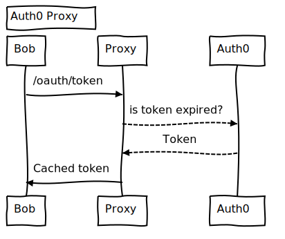

# Auth0 proxy

## Intro

Basic https proxy that caches M2M tokens from Auth0 and returns cached token as long as it is not expired.



## Config

Some configuration can be overriden by environment variables:

- `PORT` : port where proxy is listening.
- `CERT_PEM` & `KEY_PEM`: locations for certificate and key files.
- `PROXY_TARGET`: target where proxy will be redirecting calls (it refers to Auth0 domain)

## Docker

`Dockerfile` is provided to build docker image with following command `docker build . -t proxy`.

And docker image can be run with following `docker run -p 5050:5050 proxy` and it would produce following output:

```
PEM Certificate: ./certs/cert.pem
Proxy target: https://localhost:5051
Proxy server listening on port 5050
```
